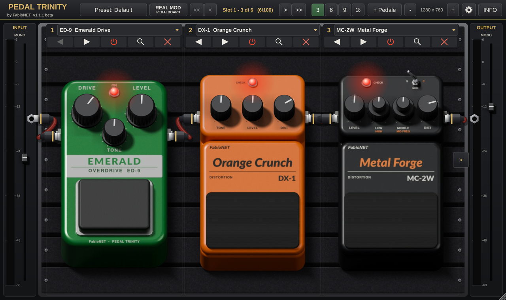

# Pedal Trinity

**Pedaliera virtuale fino a 100 pedali** con un catalogo di **220 modelli** ispirati all'intero catalogo
BOSS (compatti, Waza Craft, Twin, serie 200/500, amp e IR simulator, selettori A/B, tuner, looper) più
l'overdrive verde stile Tube Screamer. Interfaccia fotorealistica con pomelli 3D regolabili sull'immagine.



| | |
|---|---|
| **Versione** | 1.1.1 beta |
| **Autore** | FabioNET |
| **Licenza** | [GNU GPL v3](LICENSE) |
| **Formati** | VST3 · LV2 · Standalone |
| **Sistemi** | Linux (pacchetto `.deb`) · Windows 10/11 x64 (installer, driver **ASIO**) |
| **Framework** | C++20 · JUCE 7.0.12 · NeuralAmpModelerCore 0.5.4 |

## Funzioni

* **Fino a 100 slot** in catena; su **ogni slot** c'è il menu di scelta del pedale (per categorie).
* Slot **spostabili** a mano (trascinamento dall'intestazione o dal corpo del pedale, anche sulle celle libere)
  o con i tasti ◀ ▶, eliminabili, duplicabili; accensione dal footswitch.
* **Cavi jack** disegnati tra i pedali, dal meter INPUT al primo pedale e dall'ultimo al meter OUTPUT:
  attraversano gli slot vuoti e si sdoppiano in A/B dopo lo splitter.
* **Splitter SPL-3** in qualsiasi punto della catena: MONO, **DUAL** (due catene mono, A = L e B = R, su due file)
  o **STEREO** (i pedali a doppio jack elaborano A e B, un pedale mono riporta il segnale in mono come
  con i cavi veri). BALANCE e LEVEL A/B in ingresso, BALANCE / LEFT / RIGHT in uscita.
* **Opzioni** (tasto con l'ingranaggio): **6 temi** della pedaliera — Pedana Pro (alluminio a lamelle con
  tessuto a strappo, predefinito), Tolex e cromo, Noce e ottone, British Green, Alluminio spazzolato,
  Studio notte — con pedali renderizzati senza sfondo e con la propria ombra; cavi visibili e colore dei cavi.
  Il contrasto di testi e segni è verificato per ogni tema (WCAG 2.1).
* **REAL MOD PEDALBOARD** (tasto rosso nella barra): la pedaliera si trasforma nelle **repliche fedeli
  dei pedali reali** — 216 modelli BOSS con sigla e nome veri, forma e misure ufficiali (compatti, Twin,
  serie 200/500, unità da pavimento, pedali di volume e wah a bilanciere, Rocker, box d'epoca) e comandi
  nella posizione reale; il bilanciere si trascina, i footswitch dei looper funzionano. Il suono non cambia;
  ripremendo il tasto tutto torna com'era. Si possono usare anche le **proprie foto** (cartella RealPhotos),
  appoggiate in rilievo sulla replica; le foto restano sul proprio computer.
* **NAM-A1A2 Model** (rosso sangue, contenitore grande): lettore di modelli **Neural Amp Modeler**
  (A1, A2-Lite / A2-Full, LSTM; file `.nam` e `.namb`) con due canali **A** e **B**, ciascuno con modello
  e **IR**. Sul pedale: INPUT, BASS / MIDDLE / TREBLE (tonestack del plugin NAM), OUTPUT, volumi NAM e IR
  per canale, footswitch A e B e meter a tacche LED (IN, NAM, IR per canale). Nel pannello di zoom:
  caricamento dei file, pomello **SLIM** (attivo solo con modelli A2 slimmable), calibrazione d'ingresso
  in dBu, uscita Raw / Normalized / Calibrated, noise gate — come nel plugin NAM ufficiale.
* **Sicurezza dei file NAM**: sono accettati solo `.nam` / `.namb` il cui contenuto corrisponde
  all'estensione; ogni file è verificato prima dell'uso (struttura, versione, architettura ammessa,
  **numero esatto dei pesi** richiesto dalla rete, valori finiti, prova d'ascolto a vuoto) e i file alterati
  sono rifiutati con il motivo. Nei preset è salvata l'impronta **SHA-256**: un file cambiato dopo il
  salvataggio non viene caricato.
* **Meter INPUT e OUTPUT** laterali (mono o stereo secondo lo splitter) con fader del volume d'ingresso e d'uscita.
* **Scorrimento** a 3 pedali alla volta o a pagine (i tasti compaiono quando la catena supera la vista);
  **viste 3 / 6 / 9 / 18** pedali contemporaneamente.
* **Zoom** della finestra da 1280×760 fino a 2560×1440 (2K) e **pannello di zoom** del singolo pedale.
* **Preset**: di fabbrica e dell'utente, salva / esporta / importa (`.ptpreset`), stato salvato nel progetto DAW.
* Tasto **INFO** con licenza, autore, versione e [guida illustrata in PDF](docs/PedalTrinity_Guida.pdf).

## Emulazione

* **Pedali analogici a guadagno** (overdrive, distorsori, fuzz, metal, ampli): netlist a stadi con i valori reali
  dei componenti → funzioni di trasferimento esatte (bilineare), diodi risolti con Shockley + Newton-Raphson,
  triodi 12AX7 (Koren), stack Fender/Marshall (Yeh), sovracampionamento 4×.
* **BBD** (chorus, flanger, vibrato, Dimension, DM-2…): bucket-brigade con clock reale, filtri anti-alias, compander.
* **Digitali** (DD, RV, PS, SY…): dalle specifiche dei manuali ufficiali.
* Fonti e dati di ogni pedale: [`docs/research/`](docs/research) (schemi di fabbrica, service note, cloni, manuali).
* Il catalogo completo con affidabilità dei dati è nella guida PDF.

## Installazione

### Linux (Ubuntu 22.04+, Debian 12+, Mint 21+)
```bash
sudo apt install ./pedal-trinity_1.1.1-beta_amd64.deb
```
Installa `/usr/lib/vst3/Pedal Trinity.vst3`, `/usr/lib/lv2/Pedal Trinity.lv2` e l'app `pedal-trinity`
(nel menu *Audio*). La guida si trova in `/usr/share/doc/pedal-trinity/`.

### Windows 10/11 (x64)
Esegui `PedalTrinity-1.1.1-beta-Windows-x64-Setup.exe`. Il VST3 va in
`C:\Program Files\Common Files\VST3`, l'LV2 in `C:\Program Files\Common Files\LV2`.
L'app standalone supporta i driver **ASIO** (selezionati automaticamente al primo avvio se presenti),
WASAPI e DirectSound.

## Rami del repository

| Ramo | Contenuto |
|---|---|
| `main-linux` | sorgenti + CI Linux (build, autotest, pacchetto `.deb`, archivio `.tar.xz`) |
| `main-windows` | sorgenti + CI Windows (build MSVC con ASIO SDK, autotest, installer Inno Setup, `.zip`) |

## Compilazione dai sorgenti

Linux:
```bash
sudo apt install build-essential cmake ninja-build libasound2-dev libjack-jackd2-dev \
  libfreetype6-dev libfontconfig1-dev libx11-dev libxext-dev libxrandr-dev libxinerama-dev libxcursor-dev
cmake -B build -G Ninja -DCMAKE_BUILD_TYPE=Release     # scarica JUCE 7.0.12
cmake --build build
"build/PedalTrinity_artefacts/Release/Standalone/Pedal Trinity" --selftest
bash packaging/linux/build_deb.sh build dist
```

Windows (Visual Studio 2022):
```bat
cmake -B build -G "Visual Studio 17 2022" -A x64 -DPT_ASIO_SDK_DIR=C:\percorso\asiosdk
cmake --build build --config Release
iscc packaging\windows\PedalTrinity.iss
```
Lo [Steinberg ASIO SDK](https://www.steinberg.net/developers/) (disponibile anche con licenza GPLv3)
si scarica separatamente; la CI lo scarica automaticamente.

## Struttura

```
Source/
  engine/             motore: catena lock-free (Chain), circuiti a stadi (Circuit), famiglie DSP (Fx*.cpp),
                      catalogo generato (Catalog.inc)
  gui/                slot, vista del pedale, comandi 3D, pannelli zoom e info
  Presets.cpp         preset utente/fabbrica
  StandaloneApp.cpp   app standalone (ASIO, --selftest, --screenshot)
Resources/            render dei 220 pedali, filmstrip 3D dei comandi, licenza, guida PDF
docs/research/        dossier tecnici con le fonti di ogni pedale
docs/guide/           guida (LaTeX) generata da tools/build_guide.sh
packaging/            .deb (Linux) e installer Inno Setup (Windows)
tools/art/            catalogo dei modelli (catalog_*.py, CATALOG_SPEC.md), serigrafie, render Blender,
                      assemblaggio: servono solo per rigenerare immagini e catalogo, non per compilare
```

## Grafica

Le immagini dei pedali e i fotogrammi 3D dei comandi sono **render originali** creati con Blender
(`tools/art/render_pedals.py`), non fotografie di prodotti commerciali; nomi e sigle sui pedali sono
originali. Pipeline: `catalog.py` → `make_catalog_textures.py` → `render_pedals.py` → `assemble_catalog.py`.
Il plugin incorpora le immagini: la compilazione richiede solo un compilatore C++ e CMake.

## Marchi

Pedal Trinity è un progetto indipendente. *Ibanez* e *Tube Screamer* sono marchi di Hoshino Gakki Co.;
*BOSS*, *Roland*, *Waza Craft* e le sigle dei pedali BOSS (DS-1, MT-2, GE-7, …) sono marchi di Roland
Corporation; *Fender* di Fender Musical Instruments Corporation.
I nomi sono citati solo per indicare il suono di riferimento: nessuna affiliazione o approvazione.
VST è un marchio di Steinberg Media Technologies GmbH. ASIO è un marchio e software di Steinberg Media Technologies GmbH.

## Licenza

Copyright © 2026 FabioNET — distribuito secondo i termini della
**GNU General Public License v3.0** (o successiva). Vedi [LICENSE](LICENSE).

Il pedale NAM-A1A2 include componenti di terze parti con licenza MIT — NeuralAmpModelerCore,
AudioDSPTools e parti di NeuralAmpModelerPlugin (Steven Atkinson), nam-binary-loader (TONE3000),
nlohmann/json — ed Eigen (MPL 2.0): testi in [Source/third_party/LICENSE-NAM.txt](Source/third_party/LICENSE-NAM.txt).
